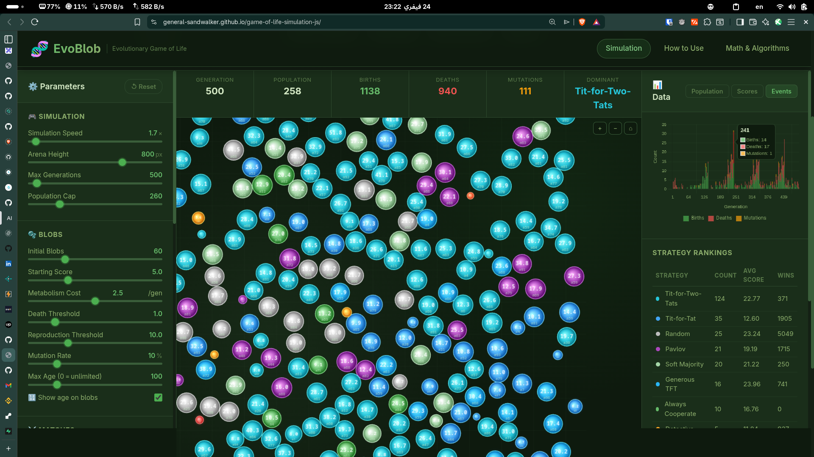
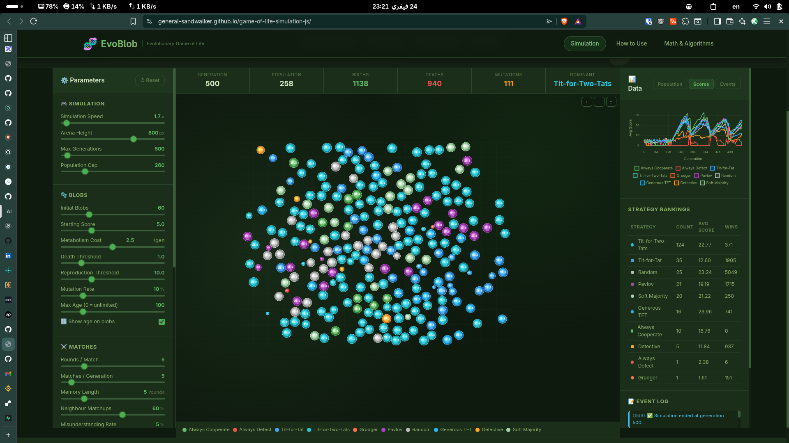
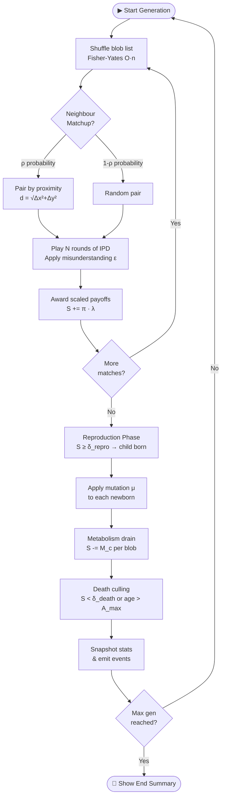
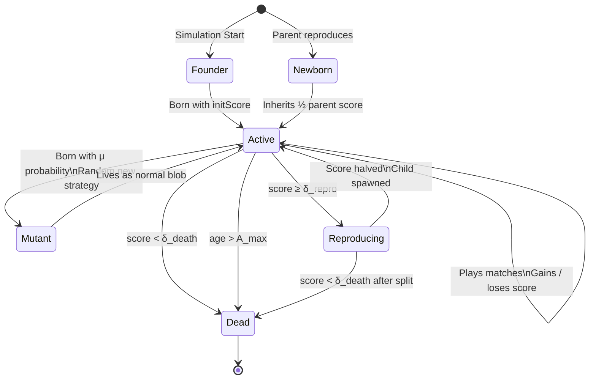

<div align="center">


# EvoBlob

### Evolutionary Game of Life Simulation

[](https://general-sandwalker.github.io/game-of-life-simulation-js/)
[](LICENSE)
[](https://developer.mozilla.org/en-US/docs/Web/JavaScript)
[](index.html)

> *Watch cooperation emerge, or collapse, in real time.*  
> Blobs compete using classic game-theory strategies, reproduce, mutate, and die
> all rendered in your browser with zero dependencies.

</div>

---

## 📸 Screenshots

<div align="center">

| Simulation Running | Scores Over Time | End-Game Summary |
|:---:|:---:|:---:|
|  |  |  |
| Real-time population chart with generational events | Average score per strategy over time | Final population breakdown after simulation ends |

</div>

---

## ✨ Features

| | Feature | Description |
|---|---|---|
| 🧬 | **10 Strategies** | Always Cooperate, Always Defect, Tit-for-Tat, TF2T, Grudger, Pavlov, Random, Generous TFT, Detective, Soft Majority |
| ⚔️ | **Iterated Prisoner's Dilemma** | Multi-round matches with configurable rounds, memory, and payoff matrix |
| 🔬 | **Spatial Pairing** | Neighbour matchups bias interactions by Euclidean proximity, cooperators cluster |
| 📡 | **Misunderstanding Noise** | Stochastic move-flip models imperfect signalling between agents |
| 🔄 | **Live Parameter Tuning** | Adjust speed, metabolism, mutation, thresholds mid-simulation without restarting |
| 📊 | **Real-time Charts** | Population area chart, score line chart, and events bar chart via Chart.js |
| 🗺️ | **Pan & Zoom Canvas** | Navigate large populations freely; click & drag, scroll to zoom |
| 📐 | **Resizable Arena** | Drag the Arena Height slider to give blobs more physical space |
| 🧾 | **Strategy Rankings** | Live table of population count, average score, and win rate per strategy |
| 📝 | **Event Log** | Verbose log of births, deaths, and mutations with generation stamps |
| 🏁 | **End-Game Modal** | Bar chart summary of the winning strategy distribution at simulation end |
| 🔢 | **Age Labels** | Toggle age display on blobs; optional max-age cap for mortality pressure |

---

## 🧮 The Mathematics

### The Prisoner's Dilemma

Two agents simultaneously choose to **Cooperate (C)** or **Defect (D)**, without knowing the other's choice. The payoff matrix (row = me, column = opponent):

$$
\begin{array}{c|cc}
 & C & D \\
\hline
C & R,\;R & S,\;T \\
D & T,\;S & P,\;P
\end{array}
$$

The fundamental constraint for a true Prisoner's Dilemma is:

$$T > R > P > S$$

Default values: $T = 5,\; R = 3,\; P = 1,\; S = 0$

---

### Score Accumulation (Iterated PD)

Each pair of blobs plays $N$ rounds per match. Over $M$ matches in a generation, blob $A$'s score update is:

$$S_A \mathrel{+{=}} \sum_{m=1}^{M} \sum_{r=1}^{N} \pi\!\left(m_A^{(r)},\; m_B^{(r)}\right) \cdot \lambda, \qquad \lambda = \frac{1}{M \cdot N}$$

The normalisation factor $\lambda$ keeps scores stable regardless of match frequency.

---

### Metabolism & Survival

Each generation, every blob pays a metabolic cost $M_c$:

$$S_{t+1} = S_t - M_c$$

A blob **dies** if $S < \delta_{\text{death}}$, or if its age exceeds $A_{\max}$.  
A blob **reproduces** if $S \geq \delta_{\text{repro}}$, splitting its energy equally:

$$S_{\text{parent}} \leftarrow \frac{S_{\text{repro}}}{2}, \qquad S_{\text{child}} = \frac{S_{\text{repro}}}{2}$$

---

### Mutation

Each newborn has probability $\mu$ of inheriting a uniformly random *different* strategy:

$$P(\text{strategy}_{child} \neq \text{strategy}_{parent}) = \mu, \quad \mu \in [0, 1]$$

---

### Spatial Pairing

When Neighbour Matchups are enabled, pair selection is biased by Euclidean distance. The probability of two blobs interacting decreases with distance $d$:

$$d(A, B) = \sqrt{(x_A - x_B)^2 + (y_A - y_B)^2}$$

This introduces **spatial assortment**, cooperators can form protective clusters, a key mechanism for the evolution of cooperation identified by Nowak & May (1992).

---

### Misunderstanding Rate

With probability $\varepsilon$, a blob's intended move is flipped (implementation noise):

$$P(\hat{m} \neq m) = \varepsilon$$

This tests strategy robustness. Tit-for-Tat decimates under high noise; Generous TFT and TF2T are significantly more resilient.

---

## 🔄 Simulation Loop



---

## 🫧 Blob Lifecycle



---

## 🧠 Strategies at a Glance

| # | Strategy | Rule | Trait |
|---|---|---|---|
| 1 | **Always Cooperate** | Always C | Pacifist, exploitable |
| 2 | **Always Defect** | Always D | Pure exploiter |
| 3 | **Tit-for-Tat** | Cooperate first; mirror last move | Nice, forgiving, retaliatory |
| 4 | **Tit-for-Two-Tats** | Defect only after 2 consecutive D | Noise-tolerant TFT variant |
| 5 | **Grudger** | Cooperate until first betrayal; then D forever | Unforgiving |
| 6 | **Pavlov** | Win-stay, lose-shift | Self-correcting, adaptive |
| 7 | **Random** | 50/50 on each round | Stochastic baseline |
| 8 | **Generous TFT** | TFT but forgives D with 10% probability | Breaks mutual-defection spirals |
| 9 | **Detective** | Probe (C,D,C,C); exploit if no retaliation, else TFT | Cunning probe-and-exploit |
| 10 | **Soft Majority** | Cooperate if opponent C ≥ 50% of past rounds | Tolerance-weighted |

---

## 🚀 Quick Start

```bash
# Clone the repo
git clone https://github.com/general-sandwalker/game-of-life-simulation-js.git
cd game-of-life-simulation-js

# Open in browser, no build step required
open index.html         # macOS
xdg-open index.html     # Linux
start index.html        # Windows
```

Or visit the **[live demo](https://general-sandwalker.github.io/game-of-life-simulation-js/)**, no installation needed.

---

## 🗂 Project Structure

```
game-of-life-simulation-js/
│
├── index.html              # Main simulation page
├── favicon.svg             # DNA-blob icon
├── css/
│   └── style.css           # Main app styles (dark green theme)
├── js/
│   └── app.js              # Bundled simulation + renderer + UI
├── docs/
│   ├── tutorial.html       # How to Use guide
│   ├── math.html           # Math & Algorithms (KaTeX)
│   └── css/docs.css        # Docs styles
├── res/                    # Screenshots
└── .github/workflows/
    └── deploy.yml          # GitHub Pages CI/CD
```

---

## 🎛 Key Parameters

| Parameter | Default | Description |
|---|---|---|
| Arena Height | 500 px | Physical size of the simulation canvas |
| Speed | 5× | Generations computed per animation frame |
| Initial Blobs | 60 | Starting population size |
| Starting Score | 5.0 | Each blob's energy at generation 0 |
| Metabolism Cost | 1.5/gen | Energy drained passively each generation |
| Death Threshold | 1.0 | Score below which a blob dies |
| Repro Threshold | 8.0 | Score at which a blob splits and reproduces |
| Mutation Rate | 5% | Probability a child inherits a random strategy |
| Max Age | ∞ | Optional senescence cap |
| Rounds / Match | 5 | IPD rounds per one-on-one encounter |
| Matches / Gen | 10 | Pairing rounds per generation |
| Memory Length | 5 | Rounds remembered per opponent |
| Neighbour Matchups | 50% | Probability of pairing with the nearest blob |
| Misunderstanding Rate | 5% | Probability of move-flip noise |

---

## 💡 Suggested Experiments

1. **Invasion**: Start 100% Always Cooperate + 10% mutation → watch defectors invade
2. **Arms Race**: Set T=10, S=−5 → extreme temptation, observe oscillations
3. **Noise Collapse**: Raise Misunderstanding to 30% → see TFT implode, GTFT survive
4. **Spatial Evolution**: 100% Neighbour Matchups → cooperator clusters emerge
5. **Grudge War**: 50% Grudger + 50% Always Defect + 0% mutation → who wins?

---

## 🙏 Inspirations & Acknowledgements

This project stands on the shoulders of giants in evolutionary game theory:

- **Robert Axelrod**, *The Evolution of Cooperation* (1984). Axelrod's computer tournaments showed that Tit-for-Tat, despite its simplicity, outcompeted all other strategies in iterated PD rounds. EvoBlob directly replicates this tournament as a continuous evolutionary process.

- **Martin A. Nowak & Robert M. May**, *Evolutionary games and spatial chaos*, Nature (1992). Their discovery that spatial structure allows cooperation to survive against defectors is the direct inspiration for EvoBlob's Neighbour Matchups parameter.

- **John Maynard Smith**, *Evolution and the Theory of Games* (1982). His formalization of evolutionary stable strategies (ESS) underpins the frequency-dependent selection dynamics observed in every EvoBlob run.

- **Martin A. Nowak**, *Five rules for the evolution of cooperation*, Science (2006). The five mechanisms (kin selection, direct reciprocity, indirect reciprocity, network reciprocity, group selection) all have analogues that can be explored with EvoBlob's parameters.

- **Nicky Case**, [The Evolution of Trust](https://ncase.me/trust/), a beautiful interactive introduction to game theory that directly inspired the visual and pedagogical approach of this project.

- **Anatol Rapoport**, the inventor of Tit-for-Tat, whose submission to Axelrod's tournament remains one of the most profound findings in behavioural science.

---

## 📚 References

- Axelrod, R. (1984). *The Evolution of Cooperation.* Basic Books.
- Axelrod, R. & Hamilton, W. D. (1981). The evolution of cooperation. *Science*, 211(4489), 1390–1396.
- Nowak, M. A. & May, R. M. (1992). Evolutionary games and spatial chaos. *Nature*, 359, 826–829.
- Nowak, M. A. (2006). Five rules for the evolution of cooperation. *Science*, 314(5805), 1560–1563.
- Smith, J. M. (1982). *Evolution and the Theory of Games.* Cambridge University Press.
- Hofbauer, J. & Sigmund, K. (1998). *Evolutionary Games and Population Dynamics.* Cambridge University Press.
- Rapoport, A. & Chammah, A. M. (1965). *Prisoner's Dilemma.* University of Michigan Press.

---

<div align="center">

**[▶ Try It Live](https://general-sandwalker.github.io/game-of-life-simulation-js/)** &nbsp;·&nbsp;
**[How to Use](https://general-sandwalker.github.io/game-of-life-simulation-js/docs/tutorial.html)** &nbsp;·&nbsp;
**[Math & Algorithms](https://general-sandwalker.github.io/game-of-life-simulation-js/docs/math.html)**

<sub>Built with ❤️ and vanilla JavaScript · No framework, no bundler, no nonsense.</sub>

</div>
